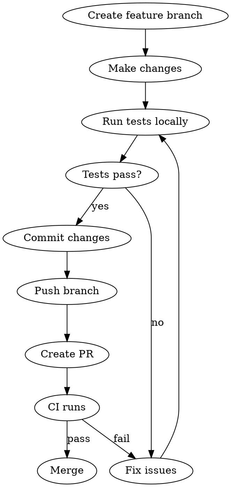

# Test, Commit, Push Workflow

## Overview

All changes to `main` must go through pull requests. CI runs unit tests and integration tests that must pass before merging.

## Workflow



## Commands

**1. Create branch:**
```bash
git checkout -b feature/my-change
```

**2. Run tests locally before committing:**
```bash
cd scripts
npm test                 # Unit tests (no API keys needed)
npm run test:integration # Integration test (needs API keys)
```

**3. Commit and push:**
```bash
git add -A
git commit -m "feat: description of change"
git push -u origin feature/my-change
```

**4. Create PR:**
```bash
gh pr create --title "My change" --body "Description"
```

## CI Checks

Both must pass before merging:

| Job | What it runs | Secrets needed |
|-----|--------------|----------------|
| `test` | `npm test` | None |
| `integration` | `npm run test:integration` | ANTHROPIC_API_KEY, BRAINTRUST_API_KEY, GOOGLE_SERVICE_ACCOUNT |

## Common Mistakes

| Mistake | Fix |
|---------|-----|
| Push directly to main | Branch protection blocks this - create a branch first |
| Skip local tests | CI will catch it, but wastes time - test locally first |
| Forget integration test | It calls real APIs - run it to catch prompt/API issues |
