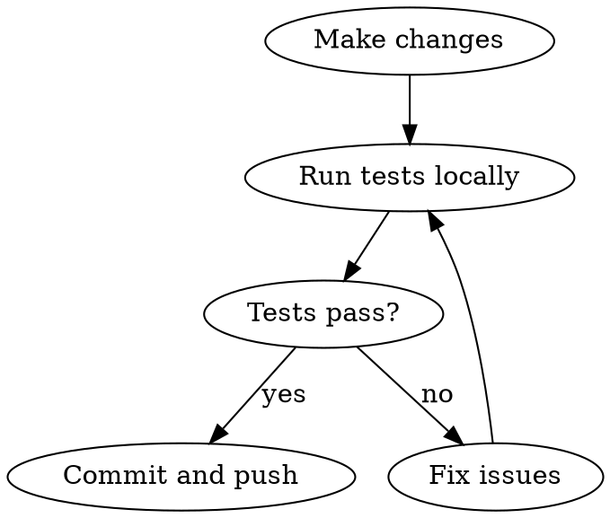

# Test, Commit, Push Workflow

## Overview

Run tests locally before committing. CI runs on push to verify, but catching issues locally is faster.

## Workflow



## Commands

**1. Run tests locally before committing:**
```bash
cd scripts
npm test                 # Unit tests (no API keys needed)
npm run test:integration # Integration test (needs API keys)
```

**2. Commit and push:**
```bash
git add -A
git commit -m "feat: description of change"
git push
```

## CI Checks

CI runs on push to main:

| Job | What it runs | Secrets needed |
|-----|--------------|----------------|
| `test` | `npm test` | None |
| `integration` | `npm run test:integration` | ANTHROPIC_API_KEY, BRAINTRUST_API_KEY, GOOGLE_SERVICE_ACCOUNT |

## Common Mistakes

| Mistake | Fix |
|---------|-----|
| Skip local tests | CI will catch it, but wastes time - test locally first |
| Forget integration test | It calls real APIs - run it to catch prompt/API issues |
